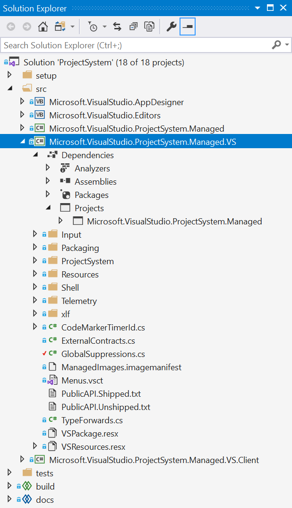
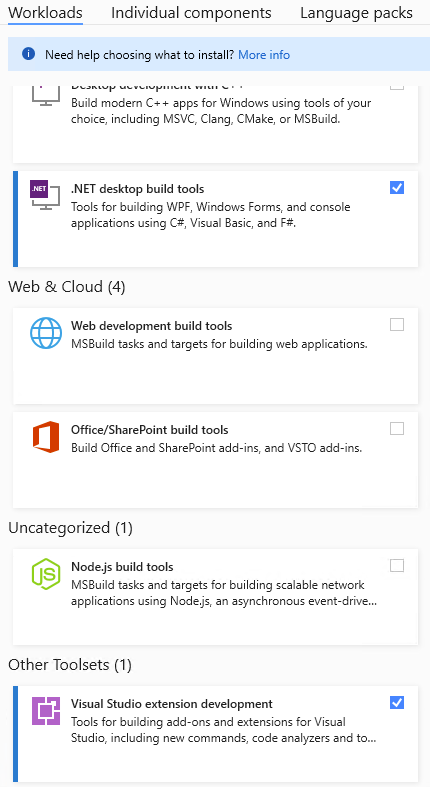

# The .NET Project System for Visual Studio

| Release             | Build                   | Compliance                   | Publish                   | Localization
|---------------------|:-----------------------:|:----------------------------:|:-------------------------:|:-------------------------:
| [main][MainBranch]  | [![MainBuild]][MainRun] | [![MainCompliance]][MainRun] | [![MainPublish]][MainRun] | [![MainLocalization]][MainRun]
| [16.11][1611Branch] | [![1611Build]][1611Run] |                              |                           |
| [17.0][170Branch]   | [![170Build]][170Run]   |                              |                           |
| [17.1][171Branch]   | [![171Build]][171Run]   |                              |                           |
| [17.2][172Branch]   | [![172Build]][172Run]   |                              |                           |
| [17.3][173Branch]   | [![173Build]][173Run]   |                              |                           |
| [17.4][173Branch]   | [![174Build]][174Run]   | [![174Compliance]][174Run]   | [![174Publish]][174Run]   | [![174Localization]][174Run]

This repository contains the .NET Project System for [Visual Studio](https://www.visualstudio.com/vs/) that is written on top of the [Common Project System (CPS)](https://github.com/microsoft/vsprojectsystem) framework. In Visual Studio 2017, Visual Studio 2019, and Visual Studio 2022, this project system is used for .NET Core [SDK-style] (C#, F# and Visual Basic) and Shared Projects (C# and Visual Basic) project types. In the [long term](docs/repo/roadmap.md), this project system will be the basis for all C#, F# and Visual Basic project types. For a list of feature differences between the project systems, see [Feature Comparison](docs/feature-comparison.md).

The legacy C# and Visual Basic project systems (*csproj.dll* and *msvbprj.dll*) first shipped with Visual Studio .NET in 2002. They have served us well but are:

- Native and COM-based
- Single threaded and bound to the UI thread
- Hard to extend outside of aggregation via the use of `<ProjectTypeGuids>` and [sub types (flavors)](https://docs.microsoft.com/en-us/visualstudio/extensibility/internals/project-types)
- Separate implementations for C# and Visual Basic projects

The current .NET Project System is:

- Managed and managed-interface based
- Multi-threaded, scalable, and responsive
- Easy to extend and compose via the Managed Extensibility Framework (MEF). Many parties, including 3rd parties, can contribute to a single project system.
- A single implementation for C#, F# and Visual Basic projects

## What is a project system?
A project system sits between a project file on disk (for example, *.csproj* and *.vbproj*) and various Visual Studio features including, but not limited to, Solution Explorer, designers, the debugger, language services, build and deployment. Almost all interaction that occurs with files contained in a project file happens through the project system.

There are many technologies that come together to make up the .NET Project System:

- [MSBuild](https://github.com/dotnet/msbuild) provides the build engine and file format.
- [SDK](https://github.com/dotnet/sdk) provides the command-line interface for building, running and interacting with .NET projects, along with the necessary MSBuild tasks and targets.
- [Common Project System](https://github.com/microsoft/vsprojectsystem) provides the base building blocks for the project system including (but not limited to) project tree, build and debugger coordination and Visual Studio integration.
- [Roslyn](https://github.com/dotnet/roslyn) provides C# and Visual Basic language support including compilers, IntelliSense, refactorings, analyzers, and code fixes.
- [Visual F# tools](https://github.com/dotnet/fsharp) provides F# language support.

## How do I build the repository?
This repository is built on .NET Framework and requires the .NET Framework version of [MSBuild](https://docs.microsoft.com/en-us/visualstudio/msbuild/msbuild?view=vs-2022) to build successfully. Additionally, there is a dependency on the [Visual Studio SDK](https://docs.microsoft.com/en-us/visualstudio/extensibility/starting-to-develop-visual-studio-extensions?view=vs-2022) as the .NET Project System is bundled as a Visual Studio Extension for deployment into Visual Studio.

Here is how to acquire the necessary components:
- Install the latest [Visual Studio](https://visualstudio.microsoft.com/downloads/)
  - Select these workloads during installation:
    - .NET desktop build tools
    - Visual Studio extension development

After the necessary components are installed, simply run the `build.cmd` batch file at the root of the repository. This will build, test, and bundle the repository appropriately.

### **build.cmd** flags
All the command line arguments provided to **build.cmd** get forwarded to MSBuild. There are some special properties we've set up for building this repo.
- For Projects:
  - `/p:SrcProjects=[true or false]`: Includes the projects within the **src** directory. Default: `true`
  - `/p:TestProjects=[true or false]`: Includes the projects within the **tests** directory. Default: `true`
  - `/p:SetupProjects=[true or false]`: Includes the projects within the **setup** directory. Default: `true`
- For Targets:
  - `/p:Restore=[true or false]`: Runs the **Restore** target to acquire project dependencies. Default: `true`
  - `/p:Build=[true or false]`: Runs the **Build** target to compile the projects into assemblies. Default: `true`
  - `/p:Rebuild=[true or false]`: Runs the **Rebuild** target which cleans and builds the projects. Default: `false`
  - `/p:Test=[true or false]`: Runs the **Test** target to execute the xUnit test projects. Default: `true`
  - `/p:Pack=[true or false]`: Runs the **Pack** target to bundle the projects into NuGet packages. Default: `true`

## How do I engage and contribute?
We welcome you to try things out, [file issues](https://github.com/dotnet/project-system/issues), make feature requests, and join us in design conversations. If you are looking for something to work on, take a look at our [help wanted issues](https://github.com/dotnet/project-system/issues?q=is%3Aopen+is%3Aissue+label%3A%22Help+Wanted%22) for a great place to start. Also, check out our [contributing guide](CONTRIBUTING.md).

This project has adopted a code of conduct adapted from the [Contributor Covenant](http://contributor-covenant.org/) to clarify expected behavior in our community. This code of conduct has been [adopted by many other projects](http://contributor-covenant.org/adopters/). For more information, see [Contributors Code of conduct](https://github.com/dotnet/home/blob/master/guidance/be-nice.md).

<!-- References -->

[MainBranch]:       https://github.com/dotnet/project-system/tree/main
[MainBuild]:        https://dev.azure.com/devdiv/DevDiv/_apis/build/status/DotNet/project-system/DotNet-Project-System?branchName=main&label=main&stageName=Build
[MainCompliance]:   https://dev.azure.com/devdiv/DevDiv/_apis/build/status/DotNet/project-system/DotNet-Project-System?branchName=main&label=main&stageName=Compliance
[MainPublish]:      https://dev.azure.com/devdiv/DevDiv/_apis/build/status/DotNet/project-system/DotNet-Project-System?branchName=main&label=main&stageName=Publish
[MainLocalization]: https://dev.azure.com/devdiv/DevDiv/_apis/build/status/DotNet/project-system/DotNet-Project-System?branchName=main&label=main&stageName=Localization
[MainRun]:          https://dev.azure.com/devdiv/DevDiv/_build/latest?definitionId=9675&branchName=main

[1611Branch]: https://github.com/dotnet/project-system/tree/dev16.11.x
[1611Build]:  https://dev.azure.com/devdiv/DevDiv/_apis/build/status/DotNet/project-system/DotNet-Project-System?branchName=dev16.11.x&label=dev16.11.x
[1611Run]:    https://dev.azure.com/devdiv/DevDiv/_build/latest?definitionId=9675&branchName=dev16.11.x

[170Branch]: https://github.com/dotnet/project-system/tree/dev17.0.x
[170Build]:  https://dev.azure.com/devdiv/DevDiv/_apis/build/status/DotNet/project-system/DotNet-Project-System?branchName=dev17.0.x&label=dev17.0.x
[170Run]:    https://dev.azure.com/devdiv/DevDiv/_build/latest?definitionId=9675&branchName=dev17.0.x

[171Branch]: https://github.com/dotnet/project-system/tree/dev17.1.x
[171Build]:  https://dev.azure.com/devdiv/DevDiv/_apis/build/status/DotNet/project-system/DotNet-Project-System?branchName=dev17.1.x&label=dev17.1.x
[171Run]:    https://dev.azure.com/devdiv/DevDiv/_build/latest?definitionId=9675&branchName=dev17.1.x

[172Branch]: https://github.com/dotnet/project-system/tree/dev17.2.x
[172Build]:  https://dev.azure.com/devdiv/DevDiv/_apis/build/status/DotNet/project-system/DotNet-Project-System?branchName=dev17.2.x&label=dev17.2.x
[172Run]:    https://dev.azure.com/devdiv/DevDiv/_build/latest?definitionId=9675&branchName=dev17.2.x

[173Branch]: https://github.com/dotnet/project-system/tree/dev17.3.x
[173Build]:  https://dev.azure.com/devdiv/DevDiv/_apis/build/status/DotNet/project-system/DotNet-Project-System?branchName=dev17.3.x&label=dev17.3.x
[173Run]:    https://dev.azure.com/devdiv/DevDiv/_build/latest?definitionId=9675&branchName=dev17.3.x

[174Branch]:       https://github.com/dotnet/project-system/tree/dev17.4.x
[174Build]:        https://dev.azure.com/devdiv/DevDiv/_apis/build/status/DotNet/project-system/DotNet-Project-System?branchName=dev17.4.x&label=dev17.4.x&stageName=Build
[174Compliance]:   https://dev.azure.com/devdiv/DevDiv/_apis/build/status/DotNet/project-system/DotNet-Project-System?branchName=dev17.4.x&label=dev17.4.x&stageName=Compliance
[174Publish]:      https://dev.azure.com/devdiv/DevDiv/_apis/build/status/DotNet/project-system/DotNet-Project-System?branchName=dev17.4.x&label=dev17.4.x&stageName=Publish
[174Localization]: https://dev.azure.com/devdiv/DevDiv/_apis/build/status/DotNet/project-system/DotNet-Project-System?branchName=dev17.4.x&label=dev17.4.x&stageName=Localization
[174Run]:          https://dev.azure.com/devdiv/DevDiv/_build/latest?definitionId=9675&branchName=dev17.4.x