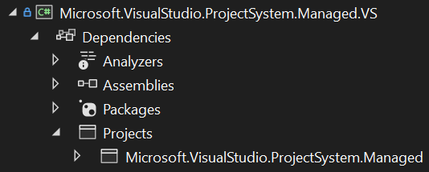
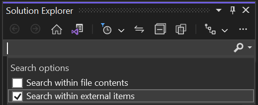

# Dependencies tree

Projects may declare various dependencies (a.k.a. reference). For example:

```xml
<ItemGroup>
  <PackageReference Include="MyPackage" Version="1.2.3" />
  <ProjectReference Include="../OtherProject/OtherProject.csproj" />
  <Reference Include="SomeAssembly.dll" />
</ItemGroup>
```

Within Visual Studio, these dependencies are displayed in _Solution Explorer_ via the project's _Dependencies_ node.

Here's a screenshot of the dependencies tree from a project in this repo:



## Searching dependencies

Solution Explorer has a search feature which will filter the tree view to show only matching items.

By default, only top-level (direct) dependencies are included in search results. To include deeper (transitive) dependencies, use the search box's drop-down and check _Search within external items_.



## Unresolved dependencies (yellow triangles)

Just because a project declares a dependency doesn't mean that the reference points to something valid/existent/compatible/etc. VS runs a [design-time build](design-time-builds.md) for each project in order to _resolve_ dependencies (amongst other tasks).

Any dependency which fails to resolve will be displayed with a yellow triangle in the tree.

A dependency is resolved when the design-time build produces a corresponding resolved MSBuild item. Unfortunately VS cannot always know why a resolved item was not produced by the design-time build, and so cannot always provide an explanation directly in the IDE. Some cases, such as certain package resolution issues, _are_ reported via child nodes in the tree, so check for those by expanding nodes where possible.

If an unresolved dependency doesn't display a message, and building the project doesn't provide an error or warning, you may inspect a [design-time build log](design-time-builds.md#diagnosing-design-time-builds) to trace why the resolved MSBuild item was not produced.

Resolved items are produced by MSBuild targets. The target to inspect depends upon the dependency type:

| Dependency type      | MSBuild target                           |
|----------------------|------------------------------------------|
| `AnalyzerReference`  | `CollectAnalyzersDesignTime`             |
| `Assembly`           | `ResolveAssemblyReferencesDesignTime`    |
| `COM`                | `ResolveComReferencesDesignTime`         |
| `FrameworkReference` | `ResolveFrameworkReferencesDesignTime`   |
| `PackageReference`   | `ResolvePackageDependenciesDesignTime`   |
| `ProjectReference`   | `ResolveProjectReferencesDesignTime2`    |
| `SdkReference`       | `CollectResolvedSDKReferencesDesignTime` |

Inspecting a design-time build's `.binlog` with the [MSBuild Structured Log Viewer](https://msbuildlog.com/) and tracing back from the relevant target will reveal why the original reference was not produces as a resolved reference. Some familiarity with [MSBuild concepts](https://learn.microsoft.com/visualstudio/msbuild/msbuild-concepts) is required to do this.

Note that for package references, you may also look in the `obj` folder for the `project.assets.json` file. Towards the end of that file there may be some messages in the `logs` property that provide insight into why packages were not resolved, though this information should be displayed in the Dependencies tree directly, along with the Package pane of the Output window, and the Error List.
