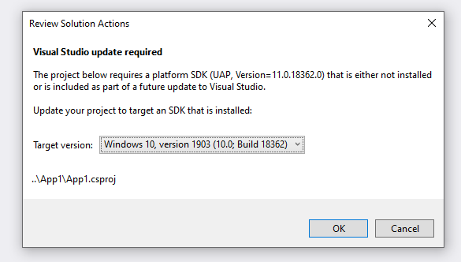

# In-product acquisition (IPA) for projects loaded by CPS

Visual Studio supports in-product acquisition (IPA) when it attempts to load a project that requires components or workloads that you are missing from your installation.

However, the mechanism used by the VS Platform is not sufficient for some of the more intricate .NET acquisition scenarios. For this reason, we use a component build in the Windows Phone era to work off of MSBuild evaluation data and present a more feature-ful UI to allow users to make better choices about missing VS components and VS Workloads. The motivation for this is to properly support the [.NET Workload](https://github.com/dotnet/designs/pull/100) concept, which factors parts of the .NET SDK into individually installable parts.

## Terminology

**IPA** - In-product acquisition, used when the user tries to load something (in some way) that they don't have tools for. IPA can be "triggered", meaning that UI pops up offering to fix their problem by suggesting things they can install that will let them load what they need.

**Resolution** - A resolution is a suggested action the user can perform when IPA is triggered. This could mean retargeting a project, installing a VS component, or offering a link for users to download stuff.

**VS Component** - This is a concrete component that enables some tooling or some experience in Visual Studio. Components are often grouped.

**VS Workload** - This is the Visual Studio Workload that exists in the VS installer. A Workload is a curated grouping of Components and Component Groups intended to enable developing a particular kind of applications (e.g, .NET web apps).

**.NET SDK Workload** - This is the term chosen to refer to a part of the .NET SDK that can be optionally installed. Confusingly, .NET SDK Workloads will map to to VS Components and not a VS Workloads. Despite their name, it's best to think of them akin to VS Components.

## Capabilities

What follows are requirements of IPA for .NET projects. The requirements from a UI standpoint are already quite possible and/or already work today, such as grouping multiple actions and listing all applicable projects for a given action.

### Detection

* Support all current VS Workload and VS Component detection that happens for VS projects today (e.g., WinForms project requires .NET desktop development VS Workload)
* Support detection of when a user needs any number of .NET SDK Workloads installed
* Support detection of when a user requires a .NET SDK that isn't installed (either implicitly or via `global.json`)
* Support detection of when a user requires a .NET Framework targeting pack they don't have installed

### Addressing issues

* Offer to install all necessary VS Components or VS Workloads
* Offer to retarget a `global.json` to a .NET SDK version that is available
* Offer to install a missing .NET SDK that is necessary (such as using a TFM the current SDK doesn't support, or specifying an SDK in `global.json` that doesn't exist)
* Offer to retarget a project to a .NET Framework version with targeting packs available
* Offer to install a specific .NET Framework targeting pack
* Offer any of the above as a bulk action for a set of applicable projects
* Offer a set of actions to take in the same UI (e.g., offer to retarget some .NET Framework projects _and_ offer to install a missing .NET SDK)
* Intelligently group different actions in the same UI

### Single-step acquisition if possible

One of the flaws of the current VS IPA system is that you can end up need to install, reload, install, reload, etc. until all your dependencies are set up correctly to work in your codebase. A goal of the experience here is to limit (or completely obviate) the need to do that by offering a bulk set of actions and things you can install in one pass.

### Prefer VS Workloads over VS Components if possible

VS Workloads are a curated set of VS Components that _should_ be capable of handling mainstream projects. If a user has an odd collection of VS Components and tries to load something that depends on a VS Component that is also contained within an appropriate VS Workload, we should suggest to install that VS Workload instead of the individual VS Component.

### Depends on correct workload authoring

The following scenarios assume that VS Workloads and VS Components are authored well. This mostly applies to the .NET SDK Workload concept, which needs appropriate factorings into VS Components and VS Workloads. For example, if it's not possible to get the iOS and Android .NET Workloads via the Xamarin VS Workload, then something has been authored wrong.

## Acquisition scenarios

What follows are a set of scenarios and what the recommended actions of the IPA experience should be.

### No Visual Studio .NET workloads installed at all

It is possible to not install anything .NET-related and still open Visual Studio. In this case, the VS platform IPA will kick in and suggest a workload or set of workloads to install. This is a rare scenario, so it's not imperative that .NET-specific IPA kicks in at this point.

### No desktop workload installed, need desktop dependencies

When loading a .NET Core WinForms or WPF project or set of projects (this includes UI component library projects), IPA should trigger and offer a resolution for all relevant projects to install the .NET desktop development VS workload.

The same applies if a user manually edits their project file (adding desktop SDK (`Microsoft.NET.Sdk.WindowsDesktop`)and/or appropriate properties).

In the future, .NET Core desktop development may be factored into a .NET SDK Workload that will be represented as a VS Component. This VS Component will be a dependency on the .NET Desktop workload, so the above scenario should still apply.

### No web workload installed, need web dependencies

When loading an ASP.NET Core project or set of projects, IPA should trigger and offer a resolution for all relevant projects to install the ASP.NET development VS workload.

The same applies if a user manually edits their project file (adding the Web SDK (`Microsoft.NET.Sdk.Web`)).

In the future, ASP.NET Core may be factored into a .NET SDK Workload that will be represented as a VS Component. This VS Component will be a dependency on the ASP.NET development workload, so the above scenario should still apply.

### No xamarin workload installed, need xamarin dependencies

When loading a pre-net5 Xamarin project or set of projects, IPA should trigger and offer a resolution for all relevant projects to install the .NET Mobole development VS workload.

If the workload is installed but optional Components that are needed by the project or set of projects are missing (such as the HAXM eumulator Component), then IPA should trigger and offer a resolution for all reelvant projects to install the necessary components. **Note:** use of these components may not be present in MSBuild evaluation data. It may not be possible to fully handle this sub-scenario.

A `net5` Xamarin project is designated by its TFM: `net5-ios`, `net5-android`, etc. _REDACTED_ will have another designation. This could be multi-TFM. In any case, whenever the user tries to load a project or set of projects and is missing the Xamarin workload, IPA should trigger and offer a resolution for all relevant projects to install the .NET Mobile development VS workload.

* What if user adds a `-something` that applies to iOS or Android to the TFM?
* What if user adds an SDK attribute?
* What are _REDACTED_ projects going to have as little thingies that people could add?

### No Azure workload installed, need Azure dependencies

When loading a project that implies the Azure workload (like Azure Functions), IPA should trigger and offer a resolution for all relevant projects to install the Azure development VS workload.

**Note:** It is possible to do _some_ Azure development (like Azure Functions), without this Workload. This is because there is a separate VS Component ("Cloud tools for web development") that you can install optionally with the ASP.NET workload to install the necessary tooling. We should understand that if the that component is installed, we shouldn't trigger IPA and suggest the Azure workload.

### No UWP workloads installed, need UWP support

When loading a UWP .NET project or set of projects, IPA should trigger and offer a resolution for all relevant projects to install the C++ desktop development VS workload.

**Open question:** what about UWP JS or UWP C++ project?

### No C++ workload installed, need C++/CLI support

When loading a C++/CLI project or set of projects, IPA should trigger and offer a resolution to install the C++ desktop development VS workload with the C++/CLI Support VS Component.

**Open question:** Should this be a supported scenario?

### Missing .NET Framework targeting pack(s)

When loading a .NET Framework project or set of projects that targets a TFM they do not have a targeting pack for, IPA should trigger and offer two resolutions:

* Install all applicable targeting packs
* Retarget an affected project or set of projects to a .NET Framework version that they user does have targeting packs for

There can be N targeting packs required for M projects, and also applies for projects that do multitargeting.

**Note:** Today the IPA experience offers a link to download targeting packs. All the targeting packs already come with VS as optional VS Components, so there should be no option to download from an external source here.

### Missing .NET SDK Workloads

Most of the .NET SDK Workload scenarios should be covered by the above acquisition scenarios, since they should be authored as VS Components that are included in VS Workloads. So if a user tries to load a project or set of projects that ultimately depends on one of those VS Workloads, IPA should trigger and offer a resolution to install the necessary Workloads.

However, in the case that this doesn't work out - if a user tries to load a project or set of projects that depends on a .NET Workload (factored as a VS Component), then IPA should trigger and offer a resolution to install the appropriate VS Component(s).

### Missing a .NET SDK required by `global.json`

If a `global.json` is present and it specifies an SDK version that the user does not have installed, the user should be prompted with the following options:

* Change the `global.json` to an SDK that is on their machine (VS carries the latest SDK available)
* Offer a link to the SDK page that corresponds to the major.minor version (e.g., SDK `3.1.100` should lead to [this page](https://dotnet.microsoft.com/download/dotnet-core/3.1))

**Note:** the SDK resolver likely needs to be involved here. For example, a user could specify `rollForward": "major"` which would most likely allow the SDK installed with VS to work with their codebase.

**Open question:** What about nested `global.json`? Is one compatible with the other (thus making their specification of the nested `global.json` unecessary)? etc.

## UX

A user could attempt to load many projects with differing dependencies on different VS Workloads or VS Components. We also want to avoid multiple "trips" where the user installs something, reloads VS, tries to load a project, has to install something, etc. This implies a different UI than what the system-wide IPA mechanism offers today. It will likely be based on the Windows developer UI here:

As you can see, this UI shows an action you can take and the project it applies to. This model can be used as a basis for more generalized .NET IPA. We would need to dramatically alter the UI to support this though, such as:

* Distinct UI pieces that distinguish different resolutions people can perform
* Space in the UI to display multiple resolution options someone can apply to N projects
* Space in the UI to list N projects where N could be large
* Perhaps some kind of summary view that lists all the resolutions being applied
* Space in the UI to indicate a resolution that applies globally when other resolutions do not

### How resolutions are displayed

There are different kinds of resolutions:

* Installing something a VS Workload or VS Component
* Retargeting something to some version of that thing on your machine
* A link to something

Each implies different UI. A set of projects may have multiple resolutions apply to them. For example, I could install a .NET Framework Targeting Pack VS Component or retarget N projects to a TFM that matches what I have a targeting pack for. When two or more resolutions are offered, there is a Radio button selection. The first option (selected by default) is to install the component that would work.

**Installing a VS Workload or VS Component** - this is a checkbox. For example, it could look like this:

**Retargeting a project or set of projects** - this is a dropdown list. For example, it could look like this:

TODO - mockup needed

**Offering a link** - this is just a link for someone to install. When the user presses the **OK** button nothing is installed.

### Grouping projects and resolutions

TODO - this needs a mockup to be more clear

There may be N projects that need a particular resolution applied to them (e.g., 50 .NET Framework projects might need a specific targeting pack). In such a scenario, we should group each project affected by a resolution together underneath that resolution.

It is possible to have M resolutions applied to N projects, where M > N. This means that grouping projects under resolutions could lead to a seemingly unecessary UI. For example, a single project could require 10 different things. This would imply a UI where there are 10 different "resolution groups" with only a single project listed underneath it. This is probably fine since it's probably more likely that N > M.

### Global resolutions

Some resolutions may be global and not a per-project thing. For example, resolving a missing .NET SDK from a `global.json` is not a per-project action.
