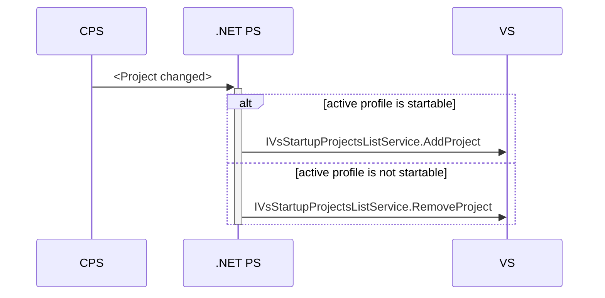
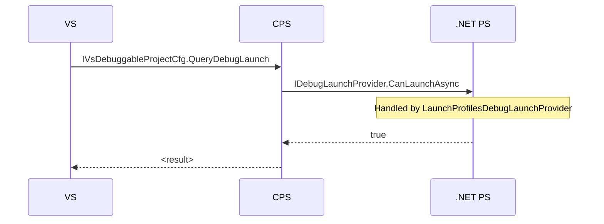
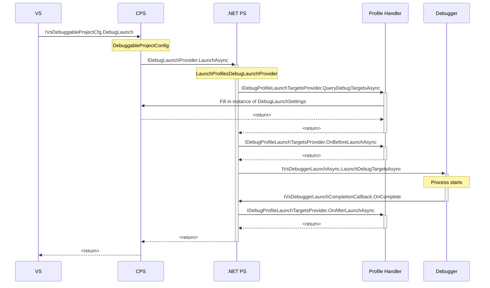

This document describes the interaction between CPS, the .NET Project System, the Debugger, and the rest of VS (hereafter just referred to as "VS") in three scenarios:

- Identifying startup projects
- Checking if a particular project can launch
- Launch (both with and without a debugger)

The emphasis here is on the interfaces used to communicate between those components; the internal operation of the components is not described. Also, the interaction between the .NET Project System and individual launch profile handlers (such as those implemented by the Web Tools team) is not described. Those handlers may have additional dependencies on other VS or Debugger interfaces.

## Terms

First, some terminology.

- **Debug launch** is the operation of launching with a debugger attached.
- **Launch profile** is a set of properties that describe how to launch a project. A project may have many of these.
- **Active launch profile** is the launch profile that is currently selected for a project. This is the profile that will be used when the project is launched.
- **Launch settings** a snapshot of project-level state, including the set of launch profiles, the active profile, and global settings.
- **Startup project** the default project for _debug launch_. If you press F5, this project gets debugged via its active profile.

## Identifying Startup Projects

The following logic is implemented in the `StartupProjectRegistrar` class.

VS wishes to know which projects can be startup projects. This flow is driven by project changes: CPS lets the .NET Project System know every time the project changes, and the .NET Project System checks if the active launch profile for the project can be run. The `IVsStartupProjectsListService` is then called to update it on whether or not the project is "startable".

This needs to happen on every project change because:

1. The active launch profile may have changed
2. The active launch profile handler may depend on arbitrary project state

### Relevant Interfaces

- `IVsStartupProjectsListService` (defined by VS, implemented by VS)

## Checking If a Project Can Launch

VS calls into CPS to ask if a project can launch, and CPS delegates this request to the .NET Project System.

### Relevant Interfaces

- `IVsDebuggableProjectCfg` (defined by VS, implemented by CPS)
- `IDebugLaunchProvider` (defined by CPS, implemented by the .NET Project System in `LaunchProfilesDebugLaunchProvider`)

## Launch (both with and without debugging)

CPS provides some standard functionality for interacting with the debugger that the .NET Project System largely does not use (at least not for launching a plain .exe).

VS tells CPS to launch a project, and CPS delegates to the .NET Project System (via CPS's `IDebugLaunchProvider`, implemented in our `LaunchProfilesDebugLaunchProvider`). The .NET Project System then fills in a standard CPS type (`DebugLaunchSettings`). It _could_ simply hand that back and let CPS handle calling the debugger, but it doesn't. Instead it calls a debugger API (`IVsDebuggerLaunchAsync`) directly. The debugger notifies us when the launch has occurred via a callback  (`IVsDebuggerLaunchCompletionCallback`).

Filling in the `DebugLaunchSettings` is accomplished by delegating to the `IDebugProfileLaunchTargetsProvider` that know how to handle the "commandName" specific in the profile. The .NET Project System provides a default implementation of this interface that handles the "Project" commandName. Other teams can provide their own implementations for other commandNames; e.g. the Web Tools team provides an implementation that handles "IISExpress".

### Relevant Interfaces

- `IVsDebuggableProjectCfg` (defined by VS, implemented by CPS)
- `IDebugLaunchProvider` (defined by CPS, implemented by the .NET Project System in `LaunchProfilesDebugLaunchProvider`)
- `IVsDebuggerLaunchAsync` (defined and implemented by the debugger)
- `IVsDebuggerLaunchCompletionCallback` (defined by the debugger, implemented by the .NET Project System in `LaunchProfilesDebugLaunchProvider`)
- `IDebugProfileLaunchTargetsProvider` (defined by the .NET Project System, implemented by the .NET Project System (`ProjectLaunchTargetsProvider`, `ErrorProfileDebugTargetsProvider`) and various other teams).

