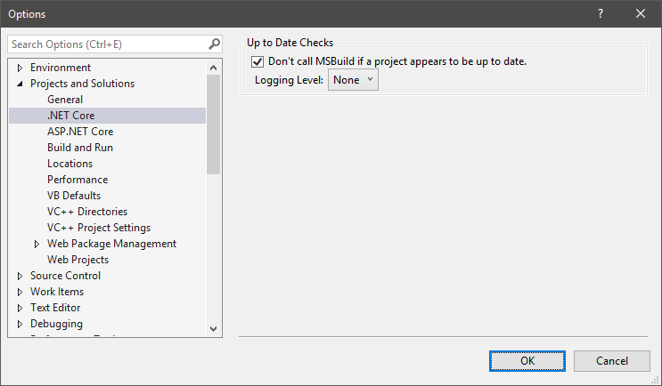

# Logging

The project system code logs information to a custom Output Window pane either
while debugging or when a certain environment variable is set.

## Enabling project system logs

### 16.7 or earlier
Setting the `PROJECTSYSTEM_PROJECTOUTPUTPANEENABLED` environment variable to
`1` enables project system logging.

### 16.8 or later
Setting the `CPS_DiagnosticRuntime` environment variable to
`1` enables project system logging.

This environment variable is set automatically when launching the
`ProjectSystemSetup` project within Visual Studio, via its
`launchSettings.json` file.

To enable this logging in other situations you may, for example:

1. Start a Developer Command Prompt
2. Run: `set CPS_DiagnosticRuntime=1`
3. Run: `devenv`
4. Open a solution
5. Use "View.Output Window"
6. Select the pane titled "Project" from the dropdown

## Up to date logs

The up-to-date check uses a separate CPS mechanism for logging (disabled by
default) that logs to the "Build" section of the "Output" pane. It is
controlled via Visual Studio's "Options" dialog:

