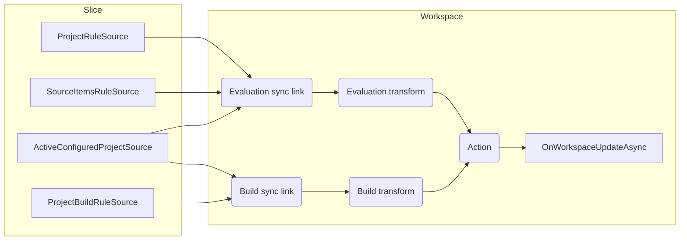

# Language Services

This document describes the implementation of the Roslyn language service host within the .NET Project System.

---

## Roslyn types and concepts

We use the following Roslyn APIs:

- `IWorkspaceProjectContext` represents Roslyn's view of the project, including all source files, references, analyzers, compiler options and so forth. We use this type to update Roslyn as project data changes.

- `IWorkspaceProjectContextFactory` unsurprisingly produces instances of `IWorkspaceProjectContext`.

---

## CPS concepts

### Slices

Slices are a concept that relate to configurations, so let's first talk about configurations.

> ℹ️ The word "configuration" is overloaded. It may represent the *build* configuration (i.e. `Debug` and `Release`), or an *active* configuration (i.e. `Debug|AnyCPU`), or a *project* configuration (i.e. `Debug|AnyCPU|net6.0`).

The easiest way to explain slices is with an example. Consider a multi-targeting project with the following project configurations:

1. `Debug|AnyCPU|net48`
2. `Debug|AnyCPU|net6.0`
3. `Release|AnyCPU|net48`
4. `Release|AnyCPU|net6.0`

The IDE has a concept of an *active configuration*. This does not include target framework (or any other implicit project dimensions). In our example, the active configuration may be either `Debug|AnyCPU` or `Release|AnyCPU`.

If `Debug|AnyCPU` is active in the IDE, then the first two project configurations are active. If the user switches to "Release", those two are deactivated, and the last two become active.

Slices provide a view of the project configurations that remove the active configuration from the picture.

In our example, we have two slices: `net48` and `net6.0`.

For a single-targeting project with project configurations `Debug|AnyCPU` and `Release|AnyCPU`, there is only a single slice.

The number of slices may change over time, such as if a target framework is added or removed.

### `IActiveConfigurationGroupSubscriptionService`

CPS exports an instance of `IActiveConfigurationGroupSubscriptionService` per unconfigured project. It is a data source that produces instances of `ConfigurationSubscriptionSources`.

Each `ConfigurationSubscriptionSources` value holds the set of slices for the project, along with an instance of `IActiveConfigurationSubscriptionSource` for the slice.

`IActiveConfigurationSubscriptionSource` extends `IProjectSubscriptionService`, via which project data may be subscribed to.

By using these types, it is possible to make a single subscription for project data per-slice, such that when the active project configuration is changed any change to the underlying data is received as a delta.

Without this facility, components that require project data from the active configuration's slices must explicitly manage subscriptions to data sources in each configuration. This is verbose, error prone and invites race conditions when configurations are changed.

---

## .NET Project System types and concepts

### Dataflow graph

Per project slice, we have:

### `LanguageServiceHost`

The `LanguageServiceHost` component hosts the Roslyn language service for a given project.

It lives in `UnconfiguredProject` scope, and is enabled by `ProjectCapability.DotNetLanguageService`.

Multi-targeting projects host a separate Roslyn workspace for each target framework.

### `IWorkspaceFactory`

Implemented once via `WorkspaceFactory`.

Its single factory method:

1. Constructs a new `Workspace` instance
2. Subscribes to both evaluation and build data
3. Updates the workspace as data changes
4. When the workspace is disposed, all data is unsubscribed for that instance

### `Workspace`

Each `UnconfiguredProject` has a `Workspace` instance per project slice.

From Roslyn's perspective, there is no relationship between the slices of a project and each is modelled separately.

This internal type is not widely distributed. Instead, it is accessed via `IWorkspaceWriter` and `IWorkspace`.

### `IWorkspace`

Exposes a subset of state from the `Workspace` class for consumption via `IWorkspaceWriter`. This type provides access to the Roslyn `IWorkspaceProjectContext`.

### `IWorkspaceWriter`

When a component needs to access the Roslyn `IWorkspaceProjectContext`, it must do so within a write lock.

Such a component uses `IWorkspaceWriter` to acquire the lock and perform its work within a callback from one of the `WriteAsync` overloads. The callback receives the `IWorkspace` object, which in turn exposes the `IWorkspaceProjectContext`. The callback must not retain a reference to this object. Future use must occur within another write lock.

### `IWorkspaceUpdateHandler` and subtypes

`IWorkspaceUpdateHandler` is just a marker interface for all types that apply changes to an `IWorkspaceProjectContext`.

Three sub-interfaces define contracts for different kinds of updates:

- `IWorkspaceUpdateHandler`
  - `ICommandLineHandler`
  - `IProjectEvaluationHandler`
  - `ISourceItemsHandler`

Each of these interfaces may have many concrete implementations.

Here's the full hierarchy as it stands today:

- `IWorkspaceUpdateHandler`
  - `ICommandLineHandler`
    - `AdditionalFilesItemHandler`
    - `AnalyzerConfigItemHandler`
    - `AnalyzerItemHandler`
    - `CommandLineNotificationHandler`
    - `CompileItemHandler`
    - `MetadataReferenceItemHandler`
  - `IProjectEvaluationHandler`
    - `CompileItemHandler`
    - `ProjectFilePathAndDisplayNameEvaluationHandler`
    - `ProjectPropertiesItemHandler`
  - `ISourceItemsHandler`
    - `DynamicItemHandler`