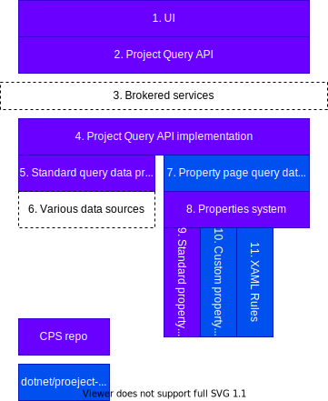

# Back-end Architecture

This document provides a high-level overview of the components that comprise the new project property pages back-end, with an emphasis on helping the reader understand the major components and where the implementations of those components may be found. It does _not_ cover the design of individual components in depth, nor does it get into the implementation details. For the former, please see the CPS documentation in [Microsoft/VSProjectSystem](https://github.com/Microsoft/VSProjectSystem); for the latter your best course is to examine the code itself in the [CPS](https://devdiv.visualstudio.com/DevDiv/_git/CPS) (Microsoft internal) and [dotnet/project-system](https://github.com/dotnet/project-system) repos.

## Layer Diagram

The following diagram identifies the major components of the new property pages back-end, their layering, and which repo the contains the relevant code.

## Components

### 1. UI

The new UI is built on top of WPF, as it provides better support for VS theming and visual customization than WinForms. The UI elements are created on the fly based on the data returned by the Project Query API.

For more details, see [UI Architecture](ui-architecture.md).

### 2. Project Query API

The Project Query API is a general mechanism for querying projects and their components (i.e., source files, references, properties, etc.) and in time will replace the various DTE and `VSLangProj*` interfaces that we currently use to expose project data to the wider world.

Properties are surfaced in two ways in the Project Query API. First, there is a general purpose API for querying the property values of projects and project items. This is largely meant for use by features outside the project system that need to inspect or change properties programatically, and is outside the scope of this document. Second, we have added a separate set of APIs tailored to retrieving properties and their metadata for the specific purposes of displaying them to the user and accepting changes to the user.

When using the Project Query API you first assemble a query object specifying the data you wish to retrieve. The query is then executed, and returns a data model populated only with the requested members. The emphasis here is on executing a small number of batch operations that retrieve or update a bunch of data all at once, rather than a lengthy series of small operations to retrieve/update individual pieces of data.

### 3. Brokered services

This is largely invisible to the Project Query API consumer, but the API has been designed from the ground up to work in Codespaces scenarios where all the project data is on the server, but may be needed by features on the client (or even in different processes on the server, or on a different server entirely). A round-trip across the network could be relatively slow--hence the emphasis on batch operations.

The Project Query API treats its use of brokered services as an implementation detail, but when making use of it we do need to be aware that data may be going across the network and we need to utilize the API accordingly.

### 4. Project Query API implementation

Internally, the Project Query API handles serializing the query, sending it across the network, deserializing it, and coordinating the actions of an extensible set of data providers. These data providers are responsible for filling in the requested properties on various entities, creating child entities from their parents, and handling various "actions" that update state in some way. For example, one provider may be responsible for creating project entities representing all the projects in the solution, while a different provider is responsible for filling in the project's name, path, GUID, language, etc. There may be multiple providers that handle the same relationship from a parent to its children or the same action. Among other things, the Project Query API implementation glues together the results of all of these providers to create the final query result.

Please note that internally, setting either a property's evaluated or unevaluated value to null will call `IProjectSnapshot.DeleteAsync` to delete the property.

### 5. Standard query data providers

CPS provides a number of built-in/standard query data providers. These generally expose data about the solution, projects, project items, references, project configuration, etc. We build off the data model that is populated by some of these providers but do not interact with them directly; no more will be said about them here.

### 6. Various data sources
### 7. Property page query data providers

Currently the only data providers specifically for the property pages are those found in the [dotnet/project-system](https://github.com/dotnet/project-system) repo. Examples (not exhaustive):

- [PropertyPageDataProvider](https://github.com/dotnet/project-system/blob/master/src/Microsoft.VisualStudio.ProjectSystem.Managed.VS/ProjectSystem/VS/Query/PropertyPages/PropertyPageDataProvider.cs) and referenced types: responsible for creating the property page entities for a project and populating their members.
- [UIPropertyDataProvider](https://github.com/dotnet/project-system/blob/master/src/Microsoft.VisualStudio.ProjectSystem.Managed.VS/ProjectSystem/VS/Query/PropertyPages/UIPropertyDataProvider.cs) and referenced types: responsible for creating the property entities for a page.
- [UIPropertyValueDataProvider](https://github.com/dotnet/project-system/blob/master/src/Microsoft.VisualStudio.ProjectSystem.Managed.VS/ProjectSystem/VS/Query/PropertyPages/UIPropertyValueDataProvider.cs) and referenced types: responsible for retrieving the values for a particular property.

Each `*Provider` has one or more related `*Producer` types. The "producers" are generally responsible for retrieving data from the underlying project system data structures independent of the Project Query API types, while the "providers" are responsible for interaction with the wider Project Query API system.

### 8. Properties system

CPS has an entire system for providing access to "project" and "item" properties, including their values and metadata. "Project" and "item" are used loosely here; the properties frequently are stored in MSBuild project files but do not have to be, and "items" do not necessarily represent files on disk. The key types in this layer are the `IProjectPropertiesProvider` and `IProjectProperties` (which handle storage and retrieval from different property sources), `IRule` (which represents a "page" of properties bound to a particular project, configured project, or item, and `IPropertyPagesCatalogProvider` and `IPropertyPagesCatalog` (which provide access to sets of `IRules`).

### 9. Standard property providers

CPS has an implementation of `IProjectPropertiesProvider` that handles reading and writing data to the MSBuild project file (the `ProjectPropertiesProvider`), among others. As many of the properties that we change through the project properties UI are in fact stored in the project file, we make heavy (though implicit) use of this type. Generally we only need to think about this type when we run up against its limitations, at which point we need to think about custom `IProjectPropertiesProvider`s.

### 10. Custom property providers

The [dotnet/project-system](https://github.com/dotnet/project-system) repo implements several `IProjectPropertiesProvider`s. The most important is the [ProjectFileInterceptedProjectPropertiesProvider](https://github.com/dotnet/project-system/blob/master/src/Microsoft.VisualStudio.ProjectSystem.Managed/ProjectSystem/Properties/InterceptedProjectProperties/ProjectFileInterceptedProjectPropertiesProvider.cs) which defaults to storing properties in the project file, but also provides a mechanism where reads and writes of individual properties can be intercepted and altered or even redirected to some other storage location. We use this to expose certain parts of the source code (like assembly attributes) and the active launch profile as properties. 

### 11. XAML Rules

At the very bottom of the implementation stack are XAML Rule files, so-called because they deserialize to instances of the `Rule` type. This is not to be confused with the `IRule` interface; a `Rule` represents a "page" of properties in the abstract, while `IRule` represents that page bound to a particular project or item.

These Rule files are where the declarative, metadata-driven aspect of the new property pages comes into play. These files declare page, the page's metadata, its properties, the storage mechanisms to use (i.e. which `IProjectPropertiesProvider` will handle a particular property), and a bunch of other property metadata: documentation links, search terms, descriptions, the property type, whether the value can vary across project configurations, etc.

Adding a new property is largely a matter of defining it in the appropriate XAML file. Adding a new page is a matter of creating a new XAML file and including it in the project as a `PropertyPageSchema` item with the appropriate `Context` metadata.
