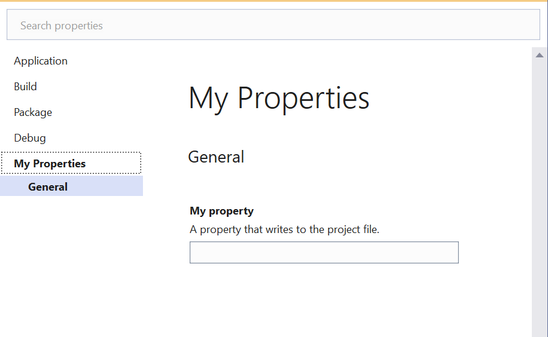

# HOW TO: Add a New Property Page

Property pages are defined by instances of the [Rule](https://docs.microsoft.com/en-us/dotnet/api/microsoft.build.framework.xamltypes.rule) class. Visual Studio uses these `Rule` objects to dynamically build the UI and bind the controls to launch settings. This HOW TO describes three options for defining and distributing these `Rule` objects:

1. [`Rule` objects read from a .xaml file on disk](#option-1-xaml-file-on-disk)
2. [`Rule` objects read from an embedded .xaml file resource](#option-2-embedded-xaml-file)
3. [`Rule` objects defined in code and exposed via `IRuleObjectProvider`](#option-3-iruleobjectprovider)

 At the end your property page will look something like this:



## Further reading

This HOWTO is concerned with how to create a `Rule` that defines a project property page; however, `Rule` objects are used for various purposes in the project system. For a more general discussion of `Rule`s, please see the following:

- [Adding XAML Rules](https://github.com/microsoft/VSProjectSystem/blob/master/doc/extensibility/adding_xaml_rules.md)
- [Extending XAML Rules](https://github.com/microsoft/VSProjectSystem/blob/master/doc/extensibility/extending_rules.md)

## Option 1: XAML file on disk

In this option, the XAML resides in a standalone .xaml file on disk and is included in the end user's project as a specific kind of MSBuild item, `PropertyPageSchema`. Visual Studio reads these items from the project to determine which property pages to show.

This may be an attractive option if you already have a NuGet package or Visual Studio extension that injects MSBuild .props and .targets files into the end user's project, or if you want to use MSBuild `Condition`s to control when the property page is available to a project. 

### Step 1 (optional): Add the Microsoft.Build.Framework package

Use the NuGet Package Manager to add the Microsoft.Build.Framework package to your project. This is an optional step, but it will allow the XAML editor to find the [Rule](https://docs.microsoft.com/en-us/dotnet/api/microsoft.build.framework.xamltypes.rule) type (and related types) and provide code completion, tool tips, Go to Definition, and other features while you type.

### Step 2: Define the XAML file

Add a new XAML file named "MyPropertyPage.xaml" to your project. Depending on how the file is created you may end up with a `<Page>` item in your project but this is not what we want as we're not using the file to describe a piece of WPF UI.

Update your project to replace the `<Page>` item with one of the following:

- SDK-style projects:
  ``` xml
  <None Update="MyPropertyPage.xaml">
    <CopyToOutputDirectory>PreserveNewest</CopyToOutputDirectory>
  </None>
  ```
- Non-SDK-style projects:
  ``` xml
  <None Include="MyPropertyPage.xaml">
    <CopyToOutputDirectory>PreserveNewest</CopyToOutputDirectory>
  </None>
  ```

Now VS won't do anything with this file but copy it to the output directory when you build.

### Step 3: Define the `PropertyPageSchema` item

Next you need to update the .props or .targets files imported by the end users' projects to properly reference the property page so Visual Studio can find it. Note that the creation and distribution of the .props and .targets files (as well as the distribution of MyPropertyPage.xaml itself) is beyond the scope of this document.

Add the following item to your .props or .targets file:

``` xml
<PropertyPageSchema Include="path\to\MyPropertyPage.xaml">
  <Context>Project</Context>
</PropertyPageSchema>
```

Note that the `Context` metadata must be present, and must have the value "Project". Rule objects such as the one defined in these .xaml files are used for multiple purposes in the project system; failing to specify the correct context may prevent your property page from being shown and/or cause bugs elsewhere.

### Step 4: Describe the property page

Replace the contents of MyPropertyPage.xaml with the following:

```xml
<?xml version="1.0" encoding="utf-8" ?>
<Rule Name="MyPropertyPage"
      Description="A description of my project properties page."
      DisplayName="My Properties"
      PageTemplate="generic"
      Order="500"
      xmlns="http://schemas.microsoft.com/build/2009/properties">

  <Rule.DataSource>
      <DataSource Persistence="ProjectFile"
                  SourceOfDefaultValue="AfterContext"
                  HasConfigurationCondition="False" />
  </Rule.DataSource>

  <StringProperty Name="MyProperty"
                  DisplayName="My property"
                  Description="A property that writes to the project file." />

</Rule>
```

The format of the file is described in detail in [Property Specification](property-specification.md), but the most important points are:
- The `Name` must be unique.
- The `PageTemplate` attribute must have the value `"generic"`.

You should now be able to build and see the MyPropertyPage.xaml copied as-is to the output directory.

And you're done. Projects that import the .targets file will now show this page when editing the project properties.

## Option 2: Embedded XAML file

In this option the XAML file is embedded in an assembly as a resource and discovered by means of a MEF export. Compared to Option 1 this requires more initial setup but does not require you to distribute an additional file. This may be an attractive option if you are already exporting MEF components for use in Visual Studio.

_Steps to be determined._

## Option 3: `IRuleObjectProvider`

_Note this option is only available starting in VS 2022 Update 1 (Dev17.1)._

In this option, `Rule` objects are defined in code and provided to the project system via MEF-exported implementations of the `IRuleObjectProvider` type. This will be an attractive option if you already have an assembly participating in the VS MEF composition, don't have a .props or .targets file to hold `PropertyPageSchema` items, or prefer to define your `Rule`s in code rather than XAML.

This is also the simplest option if you need to localize your launch profile, as you can read the localized text from .resx files or similar rather than translating the entire .xaml file and distributing the translations.

### Step 1: Add the Project System SDK

Use the NuGet Package Manager to add the Microsoft.VisualStudio.ProjectSystem.Sdk package package to your project.

### Step 2: Define the `IRuleObjectProvider`

Create a new class with the following contents:

```csharp
using System;
using System.Collections.Generic;
using Microsoft.Build.Framework.XamlTypes;
using Microsoft.VisualStudio.ProjectSystem;
using Microsoft.VisualStudio.ProjectSystem.Properties;

namespace RuleObjectProviderDemo
{
    [ExportRuleObjectProvider(name: "MyRuleObjectProvider", context: "Project")]
    [AppliesTo("MyUniqueProjectCapability")]
    [Order(0)]
    public class MyRuleObjectProvider : IRuleObjectProvider
    {
        private Lazy<List<Rule>> rules = new Lazy<List<Rule>>(CreateRules);

        private static List<Rule> CreateRules()
        {
            Rule rule = new Rule();

            rule.BeginInit();

            rule.Name = "MyPropertyPage";
            rule.Description = "A description of my project properties page.";
            rule.DisplayName = "My Properties";
            rule.PageTemplate = "generic";
            rule.Order = 500;

            rule.DataSource = new DataSource
            {
                Persistence = "ProjectFile",
                HasConfigurationCondition = false,
                SourceOfDefaultValue = DefaultValueSourceLocation.AfterContext
            };

            rule.Properties.Add(new StringProperty
            {
                Name = "MyProperty",
                DisplayName = "My property",
                Description = "A property that writes to the project file.",
            });

            rule.EndInit();

            List<Rule> rules = new List<Rule>();
            rules.Add(rule);

            return rules;
        }

        public IReadOnlyCollection<Rule> GetRules()
        {
            return this.rules.Value;
        }
    }
}

```

Important points:
- The `Rule.Name` must be unique.
- The `Rule.PageTemplate` property must have the value `"generic"`.
- The `ExportRuleObjectProvider` attribute exposes the class through MEF and allows the project system to find it.
  - The `name` parameter must be unique to this `IRuleObjectProvider`. Duplicate names will cause one or the other to be ignored.
  - The `context` paraemter should always be "Project".
- The `AppliesTo` attribute is required. The `Rule` will only be available to projects with the matching capability.
- The `Order` attribute is also required. Generally an `orderPrecedence` of "0" is fine, unless you are going to return a `Rule` object that extends an existing `Rule` from a different `IRuleObjectProvider`. In that case the `Order` of your `IRuleObjectProvider` must be higher than the other one.
- The set of `Rule` objects and the `Rule`s themselves should not depend on any VS state. That is, _do not_ dynamically generate different sets of `Rule`s, properties, etc., in the `GetRules` method based on the state of your project or any VS setting. They should be static in the same way that `Rule`s loaded from .xaml files are static.
  - Exception: It is fine for user-facing strings to vary based on the VS locale settings, as the locale cannot change while VS is running.
- `CreateRules` must handle concurrent access, hence the use of `System.Lazy` in the example above.

### Step 3: Add the assembly as MEF asset

Using the VSIX Manifest designer, ensure the assembly containing your `IRuleObjectProvider` implementation is included as a "MefComponent" asset.
