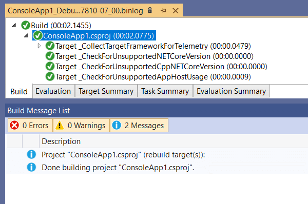

# Project System Tools
This repo contains a set of tools to make working with the Visual Studio project system for C#, Visual Basic, and F# easier. You can find the Visual Studio extension it produces [here](https://marketplace.visualstudio.com/items?itemName=VisualStudioProductTeam.ProjectSystemTools). Current features include:

## Features
Once installed, some new items appear in the `View > Other Windows` menu:

Selecting `Build Logging` will show a new pane in Visual Studio:

Click the first toolbar icon to start recording both regular and design-time builds in the project system.

Once a build is recorded, it will appear as shown. Right-clicking the build item produces a context menu:

From here you may:

- _Save Logs_ which prompts for a folder to save the `.binlog` file into
- _Open Logs_ which opens the log file inside Visual Studio
- _Open Logs External_ which opens the `.binlog` file outside of Visual Studio

The `Open Logs` option displays build results in a tree view:

By opening the `Build Message List` pane (via the `View > Other Windows` menu, as above) you can see data about the selected tree node.

## Contributing
We welcome contributions and suggestions!

This project has adopted a code of conduct adapted from the [Contributor Covenant](http://contributor-covenant.org/) to clarify expected behavior in our community. This code of conduct has been [adopted by many other projects](http://contributor-covenant.org/adopters/). For more information see [Contributors Code of conduct](https://github.com/dotnet/home/blob/master/guidance/be-nice.md).
